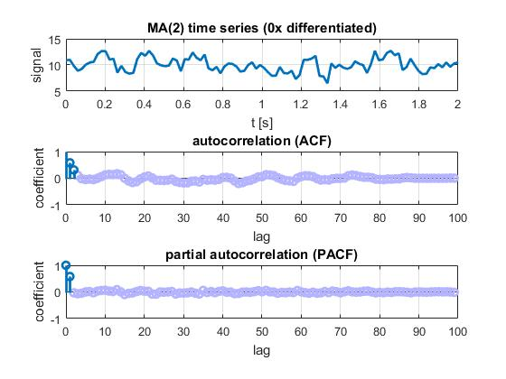

# AR/MA model experiments

AR(p) and MA(q) model exploration in MATLAB using custom sample autocorrelation and sample partial autocorrelation implementations.

## AR(2) example

The following picture shows ACF and PACF plots for an AR(2) process with the parameters

```
y(0) = -42
y(t) = 0.7 y(t-1) + 0.2 y(t-2) + WN(my=0, sigma=1) 
```

The ACF plot shows dampened sinusoidal behavior, indicating an AR(p) process, while the PACF shows no significant value after lag p=2, indicating AR(2).



## MA(1) example

The following picture shows ACF and PACF plots for an MA(1) process with the parameters

```
y(0) = epsilon(0) - 42
y(t) = 0.8 epsilon(t-1) - 42 
```


The PACF plot shows dampened sinusoidal behavior, indicating an MA(q) process, while the ACF shows no significant value after lag p=1, indicating MA(1).

## 95% confidence intervals

The confidence intervals of the ACF and PACF plots are set to `± 1.96/√N`. Here `N` is the number of observations and `1.96` is the number of standard deviations 95% of the correlation values are expected lie within in under the assumption of the null hypothesis of no correlation. 